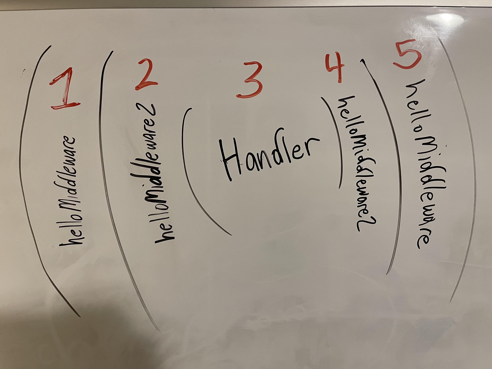

# rat
routers are terrible, so use one that isn't 😎
```js
let rat = new Rat()

rat.at('/', () => {
    console.log('Hello, World!')
})

rat.run()
```

## Installation

### Copy the Source Code
If rat becomes popular, I will host it on a CDN for fast delivery. Until then, copy the source code [directly](https://raw.githubusercontent.com/Phillip-England/rat/main/index.js).

Include the path to your static `rat.js` file in the `<head>` of your project.
```html
<head>
    <script src='/path/to/rat.js'></script>
</head>
```

## Dyanmic Paths
Dynamic paths work too! This code will log `Hello, World!` on any page with a pathname which starts with `/user/`
```js
let rat = new Rat()

rat.at('/user/{id}', () => {
    console.log('Hello, World!')
})

rat.run()
```

## Middleware

### Middleware Skeleton
Middleware allows us to reuse Javascript code on multiple pages. At it's heart, middleware are *just* functions. Here is the skeleton of a middleware function.
```js
function middlewareSkeleton(next) {
    return () => {
        // code to execute before the main handler
        next()
        // code to execute after the main handler
    }
}
```

### Applying Middleware Globally
What if we wanted every page to say hello before and after the request?
```js
const rat = new Rat()

function helloMiddleware(next) {
    return () => {
        console.log('Hello, Before Middleware!')
        next()
        console.log('Hello, After Middleware!')
    }
}

rat.use("*", helloMiddleware)

rat.at('/', () => {
    console.log('/')
})

rat.run()
```

### Applying Multiple Middlewares
What if we have multiple middleware we want to use? Just chain them.
```js
const rat = new Rat()

function helloMiddleware(next) {
    return () => {
        console.log('Hello, Before Middleware!')
        next()
        console.log('Hello, After Middleware!')
    }
}

function helloMiddleware2(next) {
    return () => {
        console.log('Hello, Before Middleware2!')
        next()
        console.log('Hello, After Middleware2!')
    }
}

rat.use("*", helloMiddleware2, helloMiddleware)

rat.at('/', () => {
    console.log('/')
})

rat.run()
```

### Order of Middleware Execution
Middleware execution starts at the *end* of the middleware chain. So in this example, the order of exection goes as follows:

1. helloMiddleware prints: `Hello, Before Middleware!`
2. helloMiddleware2 prints: `Hello, Before Middleware2!`
3. The handler for `/` prints: `/`
4. helloMiddleware2 prints: `Hello, After Middleware2!`
5. helloMiddleware prints: `Hello, After Middleware!`





```js
const rat = new Rat()

function helloMiddleware(next) {
    return () => {
        console.log('Hello, Before Middleware!')
        next()
        console.log('Hello, After Middleware!')
    }
}

function helloMiddleware2(next) {
    return () => {
        console.log('Hello, Before Middleware2!')
        next()
        console.log('Hello, After Middleware2!')
    }
}

rat.use("*", helloMiddleware2, helloMiddleware)

rat.at('/', () => {
    console.log('/')
})

rat.run()
```


